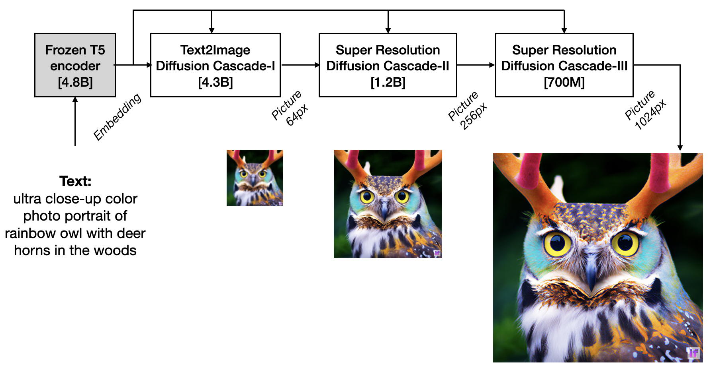

[](LICENSE)
[](https://pepy.tech/project/deepfloyd_if)

### DeepFloyd-IF

We introduce DeepFloyd, a novel state-of-the-art open-source text-to-image model with a high degree of photorealism and language understanding. DeepFloyd IF is modular composed of frozen text mode and three pixel cascaded diffusion modules, each designed to generate images of increasing resolution: 64x64, 256x256, and 1024x1024. All stages of the model utilize a frozen text encoder based on the T5 transformer to extract text embeddings, which are then fed into a UNet architecture enhanced with cross-attention and attention-pooling. The result is a highly efficient model that outperforms current state-of-the-art models such as Glide, DALL-E 2, Imagen, Parti, eDiffi and Muse, achieving a zero-shot FID score of 6.66 on the COCO dataset. Our work underscores the potential of larger UNet architectures in the first stage of cascaded diffusion models and depicts a promising future for text-to-image synthesis.



## Minimum requirements to use all IF models:
- 16GB vRAM for IF-I 4.3B (text to 64x64 base model) & IF-II 1.2B (to 256x256 upscaler)
- 24GB vRAM for IF-I 4.3B (text to 64x64 base model), IF-II 1.2B (to 256x256 upscaler) & Stable x4 (to 1024x1024 upscaler)
- 40GB vRAM for the all 3 IF diffusion cascades (IF-I, IF-II, IF-III)
- `xformers` and set env variable `FORCE_MEM_EFFICIENT_ATTN=1`


## Quick Start
[](https://colab.research.google.com/drive/1M9GkgwHZgjD_NykCq8hV5imbSbmtXX6O?usp=sharing)
[](https://huggingface.co/spaces/DeepFloyd/IF)

```shell
pip install deepfloyd_if==0.0.1rc2
pip install xformers==0.0.16
```

## Local notebook and UI demo

The Dream, Style Transfer, Super Resolution or Inpainting modes are avaliable as in a Jupyter Notebook at `IF/notebooks/pipes-DeepFloyd-IF.ipynb` or as Gradio UI demo that you can run locally with
```shell
pip install gradio
python IF/gradio/if_demo.py
```

## Integration with `diffusers`
IF is integrated with the 🤗 Hugging Face [🧨 diffusers library](https://github.com/huggingface/diffusers/), which is optimized to run on GPUs with up to xx of VRAM.
```python
#pip install diffusers transformers

from diffusers import IFPipeline
pipe = IFPipeline.from_pretrained("DeepFloyd/IF-v1", torch_dtype=torch.float16)

prompt = 'ultra close-up color photo portrait of rainbow owl with deer horns in the woods'
pipe(prompt).images[0]
```
Check the [documentation](https://github.com/huggingface/diffusers) on how to use IF with diffusers.

## Run the code locally

### Loading the models into VRAM

```python
from deepfloyd_if.modules import IFStageI, IFStageII, IFStageIII
from deepfloyd_if.modules.t5 import T5Embedder

hf_token = '<YOUR_TOKEN>'
device = 'cuda:0'
if_I = IFStageI('IF-I-IF-v1.0', device=device, hf_token=hf_token)
if_II = IFStageII('IF-II-L-v1.0', device=device, hf_token=hf_token)
if_III = IFStageIII('IF-III-L-v1.0', device=device, hf_token=hf_token)
t5 = T5Embedder(device=device, hf_token=hf_token)
```

### I. Dream
Dream is the text-to-image mode of the IF model

```python
from deepfloyd_if.pipelines import dream

prompt = 'ultra close-up color photo portrait of rainbow owl with deer horns in the woods'
count = 4

result = dream(
    t5=t5, if_I=if_I, if_II=if_II, if_III=if_III,
    prompt=[prompt]*count,
    seed=42,
    if_I_kwargs={
        "guidance_scale": 7.0,
        "sample_timestep_respacing": "smart100",
    },
    if_II_kwargs={
        "guidance_scale": 4.0,
        "sample_timestep_respacing": "smart50",
    },
    if_III_kwargs={
        "guidance_scale": 4.0,
        "sample_timestep_respacing": "super40",
    },
)
if_III.show(result['III'], size=14)
```


## II. Style Transfer
In Style Transfer mode, the output of your prompt comes out at the style of the `support_pil_img`
```python
from deepfloyd_if.pipelines import style_transfer

result = style_transfer(
    t5=t5, if_I=if_I, if_II=if_II,
    support_pil_img=raw_pil_image,
    style_prompt=[
        'A fantasy landscape in style lego',
        'A fantasy landscape in style zombie',
        'A fantasy landscape in style origami',
        'A fantasy landscape in style anime',
    ],
    seed=42,
    if_I_kwargs={
        "guidance_scale": 10.0,
        "sample_timestep_respacing": "10,10,10,10,10,10,10,10,0,0",
        'support_noise_less_qsample_steps': 5,
    },
    if_II_kwargs={
        "guidance_scale": 4.0,
        "sample_timestep_respacing": 'smart50',
        "support_noise_less_qsample_steps": 5,
    },
)
if_I.show(result['II'], 1, 20)
```


## III. Super Resolution
For super-resolution, users can run `IF-II` and `IF-III` on an image that was not necessarely generated by IF
`96px --> 1024px` (two cascades):

```python
from deepfloyd_if.pipelines import super_resolution

middle_res = super_resolution(
    t5,
    if_III=if_II,
    prompt=['face of beautiful woman, makeup, detailed picture, 4k dslr, best quality'],
    support_pil_img=raw_pil_image,
    img_scale=4.0,
    img_size=96,
    if_III_kwargs={
        'sample_timestep_respacing': 'smart100',
        'aug_level': 0.25,
        'guidance_scale': 4.0,
    },
)
high_res = super_resolution(
    t5,
    if_III=if_III,
    prompt=[''],
    support_pil_img=middle_res['III'][0],
    img_scale=1024/384,
    img_size=384,
    if_III_kwargs={
        'sample_timestep_respacing': 'super100',
        'aug_level': 0.0,
        'guidance_scale': 7.0,
    },
)
show_superres(raw_pil_image, high_res['III'][0])
```


`384px --> 1024px` with aspect-ratio:

```python
from deepfloyd_if.pipelines import super_resolution

_res = super_resolution(
    t5,
    if_III=if_III,
    prompt=['cat, detailed picture, 4k dslr'],
    support_pil_img=raw_pil_image,
    img_scale=1024/384,
    img_size=384,
    if_III_kwargs={
        'sample_timestep_respacing': 'super100',
        'aug_level': 0.2,
        'guidance_scale': 4.0,
    },
)
show_superres(raw_pil_image, _res['III'][0])
```


### IV. Inpainting


```python
from deepfloyd_if.pipelines import inpainting

result = inpainting(
    t5=t5, if_I=if_I,
    if_II=if_II,
    if_III=if_III,
    support_pil_img=raw_pil_image,
    inpainting_mask=inpainting_mask,
    prompt=[
        'blue sunglasses',
        'yellow sunglasses',
        'red sunglasses',
        'green sunglasses',
    ],
    seed=42,
    if_I_kwargs={
        "guidance_scale": 7.0,
        "sample_timestep_respacing": "10,10,10,10,10,0,0,0,0,0",
        'support_noise_less_qsample_steps': 0,
    },
    if_II_kwargs={
        "guidance_scale": 4.0,
        'aug_level': 0.0,
        "sample_timestep_respacing": '100',
    },
    if_III_kwargs={
        "guidance_scale": 4.0,
        'aug_level': 0.0,
        "sample_timestep_respacing": '40',
        'support_noise_less_qsample_steps': 0,
    },
)
if_I.show(result['I'], 2, 3)
if_I.show(result['II'], 2, 6)
if_I.show(result['III'], 2, 14)
```


### 🤗 Model Zoo 🤗
The link to download the weights as well as the model cards are avaliable on each model of the model zoo

#### Diffusers

[IF-v1](https://huggingface.co/DeepFloyd/IF-v1)

#### Original

Cascade-I (generates 64px image):
+ [IF-I-M](https://huggingface.co/DeepFloyd/IF-I-M-v1.0) [400M]
+ [IF-I-L](https://huggingface.co/DeepFloyd/IF-I-L-v1.0) [900M]
+ [IF-I-IF](https://huggingface.co/DeepFloyd/IF-I-IF-v1.0) [4.3B*]

Cascade-II (generates 256px image):
+ [IF-II-M](https://huggingface.co/DeepFloyd/IF-II-M-v1.0) [500M]
+ [IF-II-L](https://huggingface.co/DeepFloyd/IF-II-L-v1.0) [1.2B*]

Cascade-III (generates 1024px image):
+ [IF-III-L](https://huggingface.co/DeepFloyd/IF-III-L-v1.0) [700M*]

*best model

### Quantitative Evaluation

`FID = 6.66`


## License

The code in this repository is released under the GNU GPL License.

The weights are available via [the DeepFloyd organization at Hugging Face](https://huggingface.co/DeepFloyd) and have their own LICENSE.

##

## Limitations and Biases

The models avaliable in this codebase have known limitations and biases. Please refer to [the model card](https://huggingface.co/DeepFloyd/IF-I-IF-v1.0) for more information.

## Citation

```bibtex
@misc{IF2023,
    title={IF only: a pixel diffusion model with ...},
    author={A Shonenkov and M Konstantinov and D Bakshandaeva and C Schuhmann and R Vencu and D Ha and E Mostaque},
    year={2023},
    eprint={...},
    archivePrefix={arXiv},
    primaryClass={cs.CV}
}
```

## Acknowledgements

Thanks StabilityAI, LAION and ...

## 🚀 Contributors 🚀
- Thanks, [@Dango233](https://github.com/Dango233), for adaptation IF with xformers memory efficient attention
