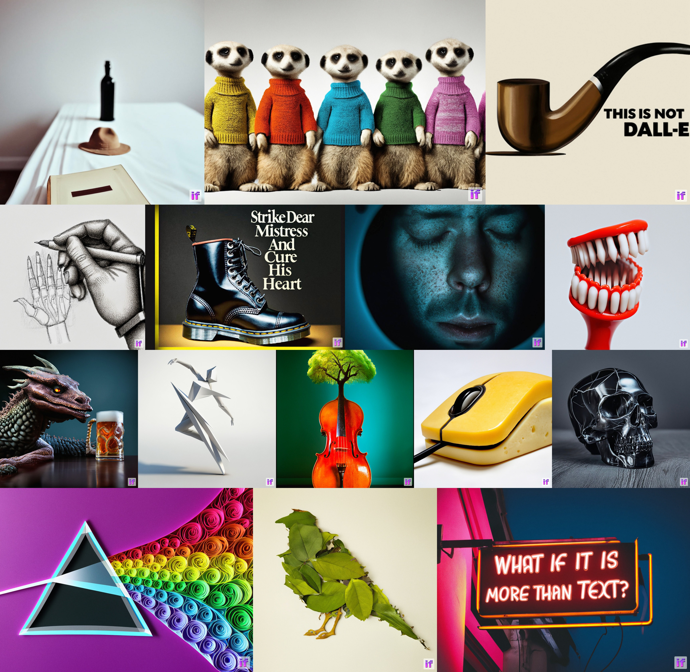
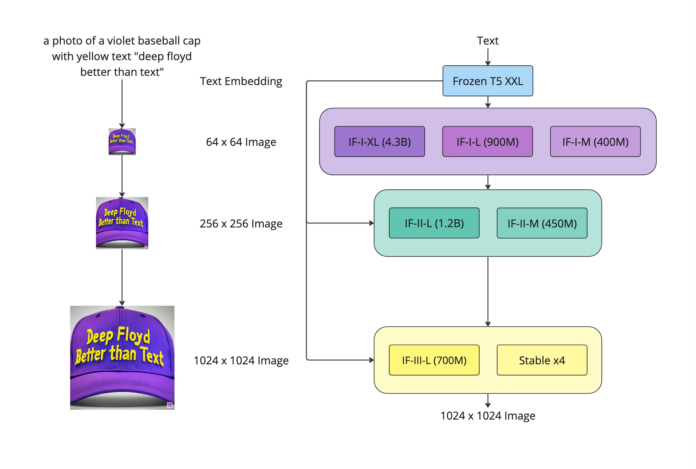
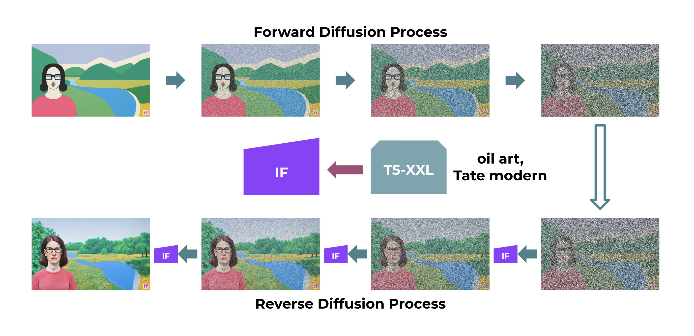
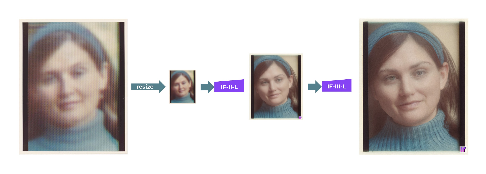

[](LICENSE)
[](LICENSE-MODEL)
[](https://pepy.tech/project/deepfloyd_if)

# IF by DeepFloyd Lab at [StabilityAI](https://stability.ai/)

<p align="center">
  
</p>

We introduce DeepFloyd IF, a novel state-of-the-art open-source text-to-image model with a high degree of photorealism and language understanding. DeepFloyd IF is a modular composed of a frozen text encoder and three cascaded pixel diffusion modules: a base model that generates 64x64 px image based on text prompt and two super-resolution models, each designed to generate images of increasing resolution: 256x256 px and 1024x1024 px. All stages of the model utilize a frozen text encoder based on the T5 transformer to extract text embeddings, which are then fed into a UNet architecture enhanced with cross-attention and attention pooling. The result is a highly efficient model that outperforms current state-of-the-art models, achieving a zero-shot FID score of 6.66 on the COCO dataset. Our work underscores the potential of larger UNet architectures in the first stage of cascaded diffusion models and depicts a promising future for text-to-image synthesis.

<p align="center">
  
</p>

*Inspired by* [*Photorealistic Text-to-Image Diffusion Models with Deep Language Understanding*](https://arxiv.org/pdf/2205.11487.pdf)

## Minimum requirements to use all IF models:
- 16GB vRAM for IF-I-XL (4.3B text to 64x64 base module) & IF-II-L (1.2B to 256x256 upscaler module)
- 24GB vRAM for IF-I-XL (4.3B text to 64x64 base module) & IF-II-L (1.2B to 256x256 upscaler module) & Stable x4 (to 1024x1024 upscaler)
- `xformers` and set env variable `FORCE_MEM_EFFICIENT_ATTN=1`


## Quick Start
[](https://colab.research.google.com/github/huggingface/notebooks/blob/main/diffusers/deepfloyd_if_free_tier_google_colab.ipynb)
[](https://huggingface.co/spaces/DeepFloyd/IF)

```shell
pip install deepfloyd_if==1.0.1
pip install xformers==0.0.16
pip install git+https://github.com/openai/CLIP.git --no-deps
```

## Local notebooks
[](https://huggingface.co/DeepFloyd/IF-I-XL-v1.0/blob/main/notebooks/pipes-DeepFloyd-IF-v1.0.ipynb)
[](https://www.kaggle.com/code/shonenkov/deepfloyd-if-4-3b-generator-of-pictures)

The Dream, Style Transfer, Super Resolution or Inpainting modes are avaliable in a Jupyter Notebook [here](https://huggingface.co/DeepFloyd/IF-I-XL-v1.0/blob/main/notebooks/pipes-DeepFloyd-IF-v1.0.ipynb).


## Integration with 🤗 Diffusers

IF is also integrated with the 🤗 Hugging Face [Diffusers library](https://github.com/huggingface/diffusers/).

Diffusers runs each stage individually allowing the user to customize the image generation process as well as allowing to inspect intermediate results easily.

### Example

Before you can use IF, you need to accept its usage conditions. To do so:
1. Make sure to have a [Hugging Face account](https://huggingface.co/join) and be loggin in
2. Accept the license on the model card of [DeepFloyd/IF-I-XL-v1.0](https://huggingface.co/DeepFloyd/IF-I-XL-v1.0)
3. Make sure to login locally. Install `huggingface_hub`
```sh
pip install huggingface_hub --upgrade
```

run the login function in a Python shell

```py
from huggingface_hub import login

login()
```

and enter your [Hugging Face Hub access token](https://huggingface.co/docs/hub/security-tokens#what-are-user-access-tokens).

Next we install `diffusers` and dependencies:

```sh
pip install diffusers accelerate transformers safetensors
```

And we can now run the model locally.

By default `diffusers` makes use of [model cpu offloading](https://huggingface.co/docs/diffusers/optimization/fp16#model-offloading-for-fast-inference-and-memory-savings) to run the whole IF pipeline with as little as 14 GB of VRAM.

If you are using `torch>=2.0.0`, make sure to **delete all** `enable_xformers_memory_efficient_attention()`
functions.

```py
from diffusers import DiffusionPipeline
from diffusers.utils import pt_to_pil
import torch

# stage 1
stage_1 = DiffusionPipeline.from_pretrained("DeepFloyd/IF-I-XL-v1.0", variant="fp16", torch_dtype=torch.float16)
stage_1.enable_xformers_memory_efficient_attention()  # remove line if torch.__version__ >= 2.0.0
stage_1.enable_model_cpu_offload()

# stage 2
stage_2 = DiffusionPipeline.from_pretrained(
    "DeepFloyd/IF-II-L-v1.0", text_encoder=None, variant="fp16", torch_dtype=torch.float16
)
stage_2.enable_xformers_memory_efficient_attention()  # remove line if torch.__version__ >= 2.0.0
stage_2.enable_model_cpu_offload()

# stage 3
safety_modules = {"feature_extractor": stage_1.feature_extractor, "safety_checker": stage_1.safety_checker, "watermarker": stage_1.watermarker}
stage_3 = DiffusionPipeline.from_pretrained("stabilityai/stable-diffusion-x4-upscaler", **safety_modules, torch_dtype=torch.float16)
stage_3.enable_xformers_memory_efficient_attention()  # remove line if torch.__version__ >= 2.0.0
stage_3.enable_model_cpu_offload()

prompt = 'a photo of a kangaroo wearing an orange hoodie and blue sunglasses standing in front of the eiffel tower holding a sign that says "very deep learning"'

# text embeds
prompt_embeds, negative_embeds = stage_1.encode_prompt(prompt)

generator = torch.manual_seed(0)

# stage 1
image = stage_1(prompt_embeds=prompt_embeds, negative_prompt_embeds=negative_embeds, generator=generator, output_type="pt").images
pt_to_pil(image)[0].save("./if_stage_I.png")

# stage 2
image = stage_2(
    image=image, prompt_embeds=prompt_embeds, negative_prompt_embeds=negative_embeds, generator=generator, output_type="pt"
).images
pt_to_pil(image)[0].save("./if_stage_II.png")

# stage 3
image = stage_3(prompt=prompt, image=image, generator=generator, noise_level=100).images
image[0].save("./if_stage_III.png")
```

 There are multiple ways to speed up the inference time and lower the memory consumption even more with `diffusers`. To do so, please have a look at the Diffusers docs:

- 🚀 [Optimizing for inference time](https://huggingface.co/docs/diffusers/api/pipelines/if#optimizing-for-speed)
- ⚙️ [Optimizing for low memory during inference](https://huggingface.co/docs/diffusers/api/pipelines/if#optimizing-for-memory)

For more in-detail information about how to use IF, please have a look at [the IF blog post](https://huggingface.co/blog/if) and [the documentation](https://huggingface.co/docs/diffusers/main/en/api/pipelines/if) 📖.

## Run the code locally

### Loading the models into VRAM

```python
from deepfloyd_if.modules import IFStageI, IFStageII, StableStageIII
from deepfloyd_if.modules.t5 import T5Embedder

device = 'cuda:0'
if_I = IFStageI('IF-I-XL-v1.0', device=device)
if_II = IFStageII('IF-II-L-v1.0', device=device)
if_III = StableStageIII('stable-diffusion-x4-upscaler', device=device)
t5 = T5Embedder(device="cpu")
```

### I. Dream
Dream is the text-to-image mode of the IF model

```python
from deepfloyd_if.pipelines import dream

prompt = 'ultra close-up color photo portrait of rainbow owl with deer horns in the woods'
count = 4

result = dream(
    t5=t5, if_I=if_I, if_II=if_II, if_III=if_III,
    prompt=[prompt]*count,
    seed=42,
    if_I_kwargs={
        "guidance_scale": 7.0,
        "sample_timestep_respacing": "smart100",
    },
    if_II_kwargs={
        "guidance_scale": 4.0,
        "sample_timestep_respacing": "smart50",
    },
    if_III_kwargs={
        "guidance_scale": 9.0,
        "noise_level": 20,
        "sample_timestep_respacing": "75",
    },
)

if_III.show(result['III'], size=14)
```


## II. Zero-shot Image-to-Image Translation



In Style Transfer mode, the output of your prompt comes out at the style of the `support_pil_img`
```python
from deepfloyd_if.pipelines import style_transfer

result = style_transfer(
    t5=t5, if_I=if_I, if_II=if_II,
    support_pil_img=raw_pil_image,
    style_prompt=[
        'in style of professional origami',
        'in style of oil art, Tate modern',
        'in style of plastic building bricks',
        'in style of classic anime from 1990',
    ],
    seed=42,
    if_I_kwargs={
        "guidance_scale": 10.0,
        "sample_timestep_respacing": "10,10,10,10,10,10,10,10,0,0",
        'support_noise_less_qsample_steps': 5,
    },
    if_II_kwargs={
        "guidance_scale": 4.0,
        "sample_timestep_respacing": 'smart50',
        "support_noise_less_qsample_steps": 5,
    },
)
if_I.show(result['II'], 1, 20)
```


## III. Super Resolution
For super-resolution, users can run `IF-II` and `IF-III` or 'Stable x4' on an image that was not necessarely generated by IF (two cascades):

```python
from deepfloyd_if.pipelines import super_resolution

middle_res = super_resolution(
    t5,
    if_III=if_II,
    prompt=['woman with a blue headscarf and a blue sweaterp, detailed picture, 4k dslr, best quality'],
    support_pil_img=raw_pil_image,
    img_scale=4.,
    img_size=64,
    if_III_kwargs={
        'sample_timestep_respacing': 'smart100',
        'aug_level': 0.5,
        'guidance_scale': 6.0,
    },
)
high_res = super_resolution(
    t5,
    if_III=if_III,
    prompt=[''],
    support_pil_img=middle_res['III'][0],
    img_scale=4.,
    img_size=256,
    if_III_kwargs={
        "guidance_scale": 9.0,
        "noise_level": 20,
        "sample_timestep_respacing": "75",
    },
)
show_superres(raw_pil_image, high_res['III'][0])
```




### IV. Zero-shot Inpainting

```python
from deepfloyd_if.pipelines import inpainting

result = inpainting(
    t5=t5, if_I=if_I,
    if_II=if_II,
    if_III=if_III,
    support_pil_img=raw_pil_image,
    inpainting_mask=inpainting_mask,
    prompt=[
        'oil art, a man in a hat',
    ],
    seed=42,
    if_I_kwargs={
        "guidance_scale": 7.0,
        "sample_timestep_respacing": "10,10,10,10,10,0,0,0,0,0",
        'support_noise_less_qsample_steps': 0,
    },
    if_II_kwargs={
        "guidance_scale": 4.0,
        'aug_level': 0.0,
        "sample_timestep_respacing": '100',
    },
    if_III_kwargs={
        "guidance_scale": 9.0,
        "noise_level": 20,
        "sample_timestep_respacing": "75",
    },
)
if_I.show(result['I'], 2, 3)
if_I.show(result['II'], 2, 6)
if_I.show(result['III'], 2, 14)
```


### 🤗 Model Zoo 🤗
The link to download the weights as well as the model cards will be available soon on each model of the model zoo

#### Original

| Name                                                      | Cascade | Params | FID  | Batch size | Steps |
|:----------------------------------------------------------|:-------:|:------:|:----:|:----------:|:-----:|
| [IF-I-M](https://huggingface.co/DeepFloyd/IF-I-M-v1.0)    |    I    |  400M  | 8.86 |    3072    | 2.5M  |
| [IF-I-L](https://huggingface.co/DeepFloyd/IF-I-L-v1.0)    |    I    |  900M  | 8.06 |    3200    | 3.0M  |
| [IF-I-XL](https://huggingface.co/DeepFloyd/IF-I-XL-v1.0)* |    I    |  4.3B  | 6.66 |    3072    | 2.42M |
| [IF-II-M](https://huggingface.co/DeepFloyd/IF-II-M-v1.0)  |   II    |  450M  |  -   |    1536    | 2.5M  |
| [IF-II-L](https://huggingface.co/DeepFloyd/IF-II-L-v1.0)* |   II    |  1.2B  |  -   |    1536    | 2.5M  |
| IF-III-L* _(soon)_                                        |   III   |  700M  |  -   |    3072    | 1.25M |

 *best modules

### Quantitative Evaluation

`FID = 6.66`


## License

The code in this repository is released under the bespoke license (see added [point two](https://github.com/deep-floyd/IF/blob/main/LICENSE#L13)).

The weights will be available soon via [the DeepFloyd organization at Hugging Face](https://huggingface.co/DeepFloyd) and have their own LICENSE.

**Disclaimer:** *The initial release of the IF model is under a restricted research-purposes-only license temporarily to gather feedback, and after that we intend to release a fully open-source model in line with other Stability AI models.*

## Limitations and Biases

The models available in this codebase have known limitations and biases. Please refer to [the model card](https://huggingface.co/DeepFloyd/IF-I-L-v1.0) for more information.


## 🎓 DeepFloyd IF creators:
- Alex Shonenkov [GitHub](https://github.com/shonenkov) | [Linktr](https://linktr.ee/shonenkovAI)
- Misha Konstantinov [GitHub](https://github.com/zeroshot-ai) | [Twitter](https://twitter.com/_bra_ket)
- Daria Bakshandaeva [GitHub](https://github.com/Gugutse) | [Twitter](https://twitter.com/_gugutse_)
- Christoph Schuhmann [GitHub](https://github.com/christophschuhmann) | [Twitter](https://twitter.com/laion_ai)
- Ksenia Ivanova [GitHub](https://github.com/ivksu) | [Twitter](https://twitter.com/susiaiv)
- Nadiia Klokova [GitHub](https://github.com/vauimpuls)

## 📄 Research Paper (Soon)

## Acknowledgements

Special thanks to [StabilityAI](http://stability.ai) and its CEO [Emad Mostaque](https://twitter.com/emostaque) for invaluable support, providing GPU compute and infrastructure to train the models (our gratitude goes to [Richard Vencu](https://github.com/rvencu)); thanks to [LAION](https://laion.ai) and [Christoph Schuhmann](https://github.com/christophschuhmann) in particular for contribution to the project and well-prepared datasets; thanks to [Huggingface](https://huggingface.co) teams for optimizing models' speed and memory consumption during inference, creating demos and giving cool advice!

## 🚀 External Contributors 🚀
- The Biggest Thanks [@Apolinário](https://github.com/apolinario), for ideas, consultations, help and support on all stages to make IF available in open-source; for writing a lot of documentation and instructions; for creating a friendly atmosphere in difficult moments 🦉;
- Thanks, [@patrickvonplaten](https://github.com/patrickvonplaten), for improving loading time of unet models by 80%;
for integration Stable-Diffusion-x4 as native pipeline 💪;
- Thanks, [@williamberman](https://github.com/williamberman) and [@patrickvonplaten](https://github.com/patrickvonplaten) for diffusers integration 🙌;
- Thanks, [@hysts](https://github.com/hysts) and [@Apolinário](https://github.com/apolinario) for creating [the best gradio demo with IF](https://huggingface.co/spaces/DeepFloyd/IF) 🚀;
- Thanks, [@Dango233](https://github.com/Dango233), for adapting IF with xformers memory efficient attention 💪;
