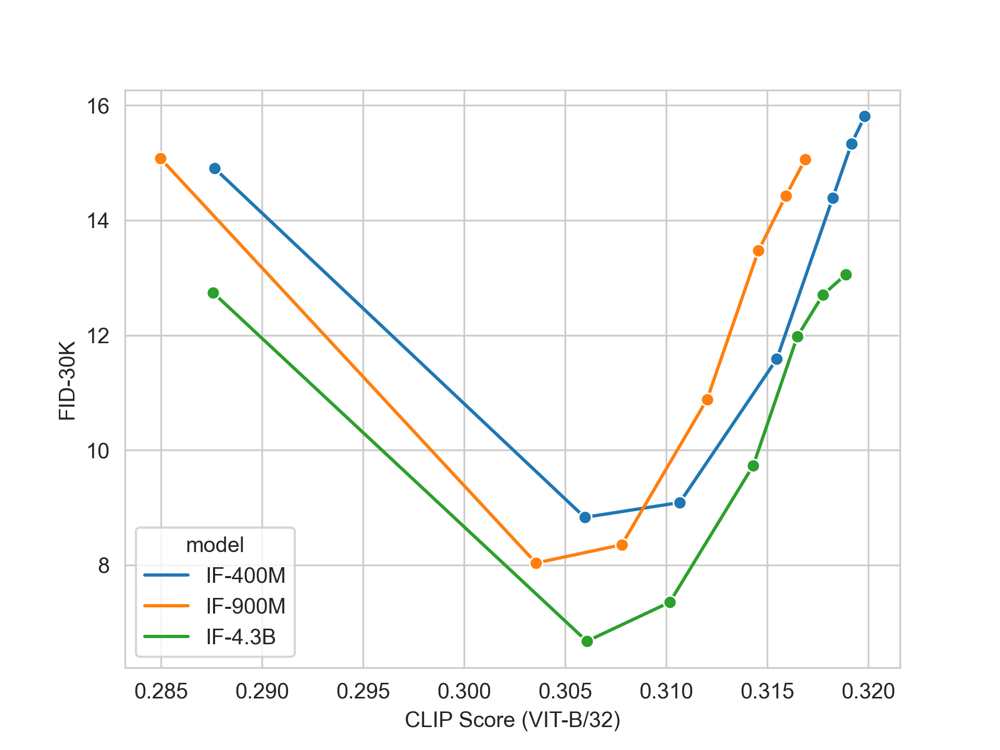

[](LICENSE)

### DeepFloyd-IF (Imagen Free)
___


## Minimum requirements to use all IF models:

- 40GB vRAM/RAM (or 16GB vRAM, but `cascade-III` will not be available)
- install xformers and set env variable `FORCE_MEM_EFFICIENT_ATTN=1`


## Quick Start

soon:
```shell
pip install deepfloyd_if==0.0.1
```


### I. Dream

```python
prompt = 'ultra close-up color photo portrait of rainbow owl with deer horns in the woods'
count = 4

result = dream(
    t5=t5, if_I=if_I, if_II=if_II, if_III=if_III,
    prompt=[prompt]*count,
    seed=42,
    if_I_kwargs={
        "guidance_scale": 7.0,
        "sample_timestep_respacing": "smart100",
    },
    if_II_kwargs={
        "guidance_scale": 4.0,
        "sample_timestep_respacing": "smart50",
    },
    if_III_kwargs={
        "guidance_scale": 4.0,
        "sample_timestep_respacing": "super40",
    },
)
if_III.show(result['III'], size=14)
```


## II. Style Transfer

```python
result = style_transfer(
    t5=t5, if_I=if_I, if_II=if_II,
    support_pil_img=raw_pil_image,
    style_prompt=[
        'A fantasy landscape in style lego',
        'A fantasy landscape in style zombie',
        'A fantasy landscape in style origami',
        'A fantasy landscape in style anime',
    ],
    seed=42,
    if_I_kwargs={
        "guidance_scale": 10.0,
        "sample_timestep_respacing": "10,10,10,10,10,10,10,10,0,0",
        'support_noise_less_qsample_steps': 5,
    },
    if_II_kwargs={
        "guidance_scale": 4.0,
        "sample_timestep_respacing": 'smart50',
        "support_noise_less_qsample_steps": 5,
    },
)
if_I.show(result['II'], 1, 20)
```


## III. Super Resolution

`96px --> 1024px` (two cascades):

```python
middle_res = super_resolution(
    t5,
    if_III=if_II,
    prompt=['face of beautiful woman, makeup, detailed picture, 4k dslr, best quality'],
    support_pil_img=raw_pil_image,
    img_scale=4.0,
    img_size=96,
    if_III_kwargs={
        'sample_timestep_respacing': 'smart100',
        'aug_level': 0.25,
        'guidance_scale': 4.0,
    },
)
high_res = super_resolution(
    t5,
    if_III=if_III,
    prompt=[''],
    support_pil_img=middle_res['III'][0],
    img_scale=1024/384,
    img_size=384,
    if_III_kwargs={
        'sample_timestep_respacing': 'super100',
        'aug_level': 0.0,
        'guidance_scale': 7.0,
    },
)
show_superres(raw_pil_image, high_res['III'][0])
```


`384px --> 1024px` with aspect-ratio:

```python
_res = super_resolution(
    t5,
    if_III=if_III,
    prompt=['cat, detailed picture, 4k dslr'],
    support_pil_img=raw_pil_image,
    img_scale=1024/384,
    img_size=384,
    if_III_kwargs={
        'sample_timestep_respacing': 'super100',
        'aug_level': 0.2,
        'guidance_scale': 4.0,
    },
)
show_superres(raw_pil_image, _res['III'][0])
```


### IV. Inpainting


```python
result = inpainting(
    t5=t5, if_I=if_I,
    if_II=if_II,
    if_III=if_III,
    support_pil_img=raw_pil_image,
    inpainting_mask=inpainting_mask,
    prompt=[
        'blue sunglasses',
        'yellow sunglasses',
        'red sunglasses',
        'green sunglasses',
    ],
    seed=42,
    if_I_kwargs={
        "guidance_scale": 7.0,
        "sample_timestep_respacing": "10,10,10,10,10,0,0,0,0,0",
        'support_noise_less_qsample_steps': 0,
    },
    if_II_kwargs={
        "guidance_scale": 4.0,
        'aug_level': 0.0,
        "sample_timestep_respacing": '100',
    },
    if_III_kwargs={
        "guidance_scale": 4.0,
        'aug_level': 0.0,
        "sample_timestep_respacing": '40',
        'support_noise_less_qsample_steps': 0,
    },
)
if_I.show(result['I'], 2, 3)
if_I.show(result['II'], 2, 6)
if_I.show(result['III'], 2, 14)
```


### Model Zoo

Cascade-I:
+ IF-I-GL
+ IF-I-M [400M]
+ IF-I-L [900M]
+ IF-I-XL [2.2B]
+ IF-I-IF [4.3B]

Cascade-II:
+ IF-II-M
+ IF-II-L

Cascade-III:
+ IF-III-L

### Quantitative Evaluation



## License

The code in this repository is released under the GNU GPL License.

The weights are available via [the DeepFloyd organization at Hugging Face](https://huggingface.co/DeepFloyd).


## Citation

```bibtex
@misc{IF2023,
    title={IF only: a pixel diffusion model with ...},
    author={A Shonenkov and M Konstantinov and D Bakshandaeva and C Schuhmann and R Vencu and D Ha and E Mostaque},
    year={2023},
    eprint={...},
    archivePrefix={arXiv},
    primaryClass={cs.CV}
}
```

## Acknowledgements

Thanks StabilityAI, LAION and ...

## 🚀 Contributors 🚀
- Thanks, [@Dango233](https://github.com/Dango233), for adaptation IF with xformers memory efficient attention
